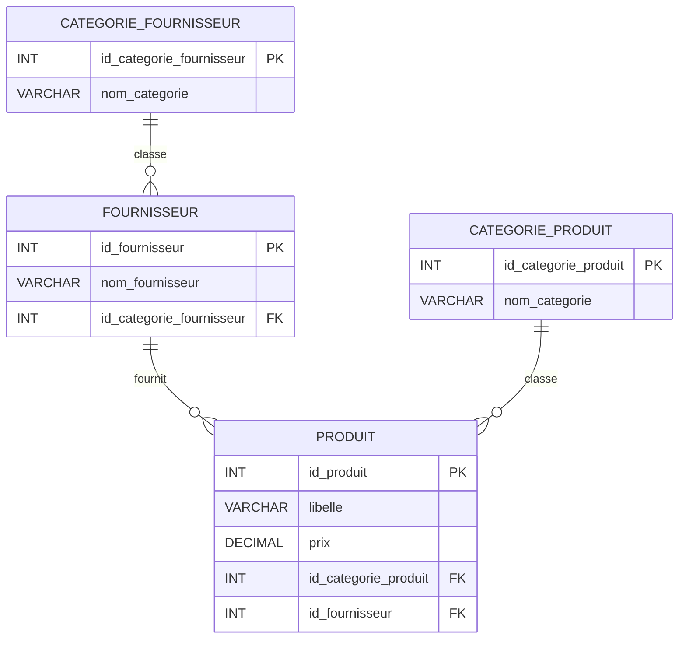

# ARCHITECTURE_PLAN

## Objectif du Projet

L'objectif de cette évolution est de renforcer la lisibilité fonctionnelle et technique de l'application de catalogue BoutikPro en ajoutant des vues de consultation multi-tables et une fonctionnalité de mise a jour securisee. Les prochaines modifications visent a exploiter de maniere plus complete le modele relationnel existant, a ameliorer la presentation console pour l'utilisateur, et a garantir une manipulation fiable des donnees sensibles (prix, libelle produit) depuis le menu Python.

## Modele Relationnel (UML/ERD)

L'architecture de donnees s'appuie sur quatre entites principales :

1. Produits : contient les informations metier de chaque article vendu.
2. Categories : classe les produits par famille.
3. Fournisseurs : represente les partenaires qui alimentent le catalogue.
4. Categories Fournisseurs : classe les fournisseurs selon leur domaine.

### Description relationnelle

- Un produit appartient a une seule categorie produit (relation N -> 1).
- Un fournisseur appartient a une seule categorie fournisseur (relation N -> 1).
- Les cles primaires sont techniques (entiers auto-incrementes).
- Les cles etrangeres assurent l'integrite referentielle entre tables metier et tables de categorisation.

### Diagramme ER (Mermaid.js)

## Plan d'Implementation (Roadmap)

### Feature 1 : Requete SQL JOIN complexe sur 4 tables avec affichage tabulaire

Objectif : recuperer, en une seule requete, une vue consolidee du catalogue en croisant Produits, Categories, Fournisseurs et Categories Fournisseurs.

Plan de realisation :

1. Ecrire une requete SQL avec jointures explicites (INNER JOIN) entre les tables cibles.
2. Selectionner des colonnes lisibles pour l'utilisateur : id produit, libelle, prix, categorie produit, fournisseur, categorie fournisseur.
3. Integrer la requete dans le flux Python existant.
4. Formater le resultat avec la bibliotheque tabulate pour un rendu console propre, aligne et facilement evaluable.

Livrable attendu : un ecran de consultation enrichi qui presente les informations reliees sans duplication manuelle.

### Feature 2 : Vue analytique par regroupement categorie produit / fournisseurs

Objectif : proposer une lecture analytique qui regroupe les donnees par categorie de produit et met en evidence les fournisseurs associes.

Plan de realisation :

1. Construire une requete d'agregation avec GROUP BY sur la categorie produit.
2. Ajouter des indicateurs simples (exemple : nombre de produits par categorie, nombre de fournisseurs distincts).
3. Structurer l'affichage en sections logiques pour faciliter l'interpretation pedagogique.
4. Integrer cette vue comme option dediee dans le menu Python.

Livrable attendu : une vue de synthese orientee aide a la decision, utile pour la demonstration orale.

### Feature 3 : Operation de mise a jour securisee depuis le menu Python

Objectif : permettre la modification d'un produit (prix ou nom) de maniere fiable et securisee.

Plan de realisation :

1. Ajouter une option de menu "Modifier un produit" avec saisie guidee.
2. Verifier les preconditions avant mise a jour (existence de l'identifiant, format de prix, valeur non vide).
3. Executer la commande UPDATE via requete parametree.
4. Confirmer l'operation a l'utilisateur et tracer un message de succes ou d'echec.

Livrable attendu : une fonctionnalite CRUD de type Update conforme aux bonnes pratiques de securite.

## Justifications Techniques

1. Normalisation relationnelle : la separation Produits/Categories et Fournisseurs/Categories Fournisseurs limite la redondance et simplifie la maintenance des donnees (logique des formes normales).
2. Requetes JOIN ciblees : les jointures relationnelles permettent d'obtenir une vision metier complete sans denormaliser la base.
3. Utilisation de tabulate : l'affichage console est plus lisible, standardise et presentable lors d'une soutenance.
4. Requetes parametrees : elles reduisent le risque d'injection SQL et garantissent un passage propre des valeurs utilisateur.
5. Organisation par roadmap : la decomposition en trois fonctionnalites facilite la planification, les tests progressifs et la justification des choix techniques face au professeur.

## Conclusion

Ce plan d'architecture encadre une evolution progressive et pedagogiquement defendable de l'application. Il relie clairement le modele de donnees, les besoins fonctionnels et les choix techniques, afin de fournir une implementation robuste, lisible et securisee dans le cadre du CCF.